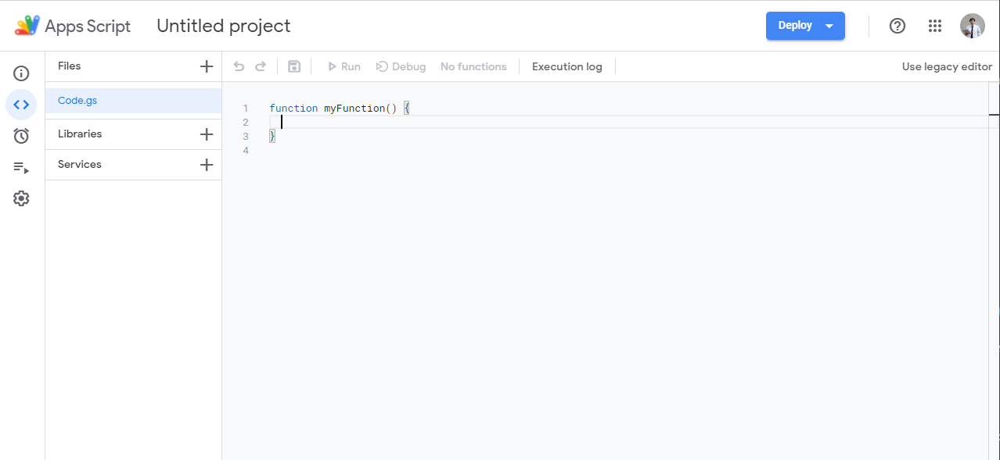

# Installation

First thing you need to do is to install the script. The script will allows you to run the flow.

To use the script, you must have acesss to items that is defined on [System Requirement](../requirement) and do the following step(s) to complete the installation.

1. Visit the repository [https://github.com/sagelga/approval-workflow](https://github.com/sagelga/approval-workflow).
   
2. On the page, select 'Code' (noticeable by the bright green button).
   
3. On option dropdown, select "Download ZIP". You will be downloading a `.zip` file containing the source code.
   
4. Go to the download destination, extracts the `.zip` file, there will be multiple `.js` file in `src/`.
   
5. Go to your Target sheet (optional).
6. In Tool Bar, select Tools > Script editor.
   
7. You will be directed to Target sheet's script editor as following.
   
8. For every `.js` file in folder `/src`, do as following:
    1. Open the file using any Text Editor (i.e. [Visual Studio Code](https://code.visualstudio.com))
    2. Copy all of its content.
    3. (optional) Create a new script file by clicking a  and named it with the same name as the file.
    4. Paste it to the Target Google Apps Script script page (in step 7).
    5. Repeat the process until you copied all of the files.
9. Done.
